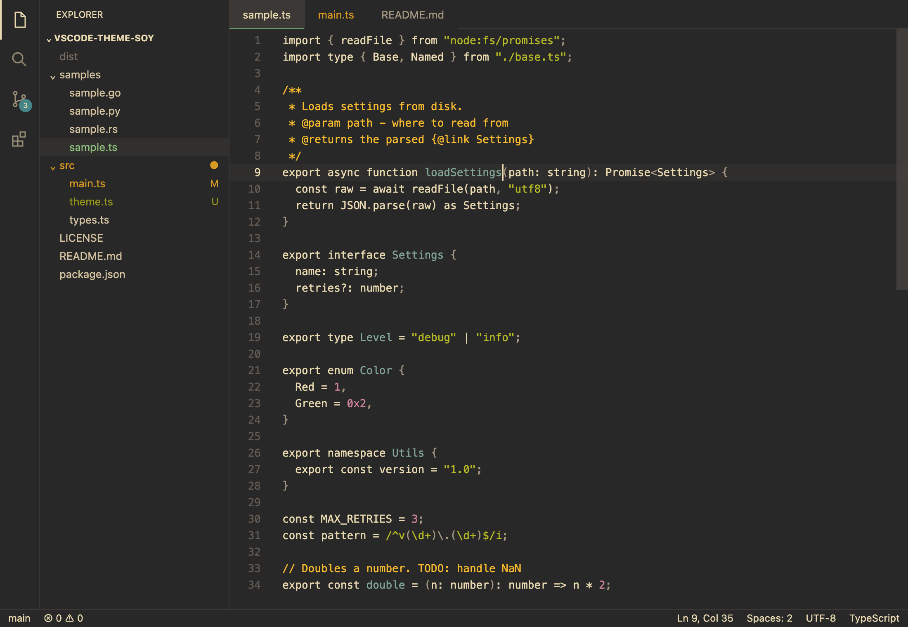
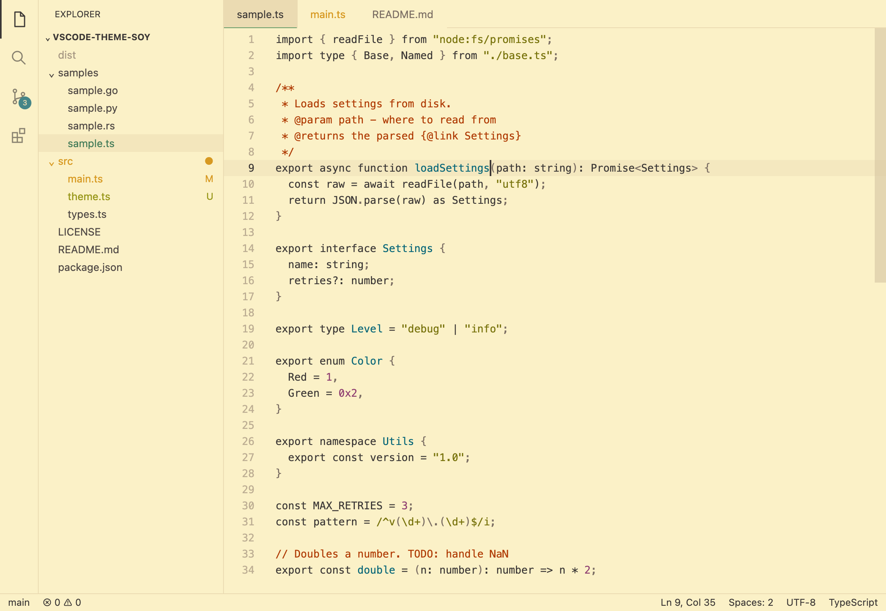
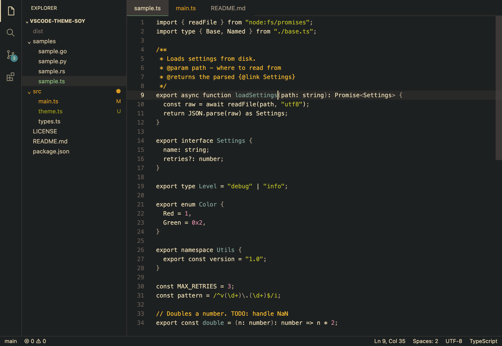
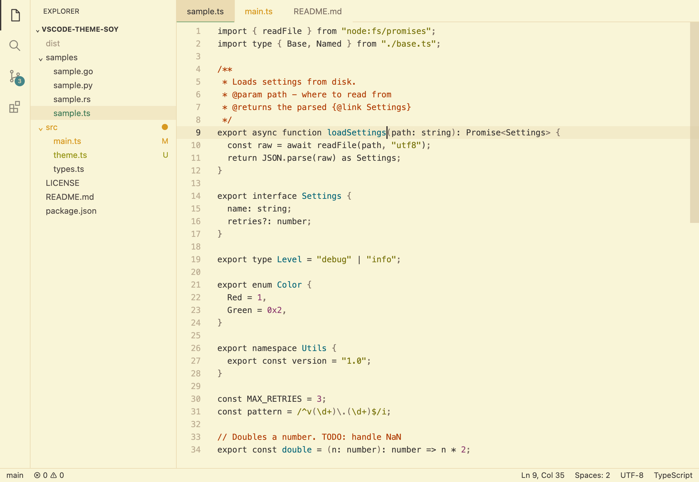
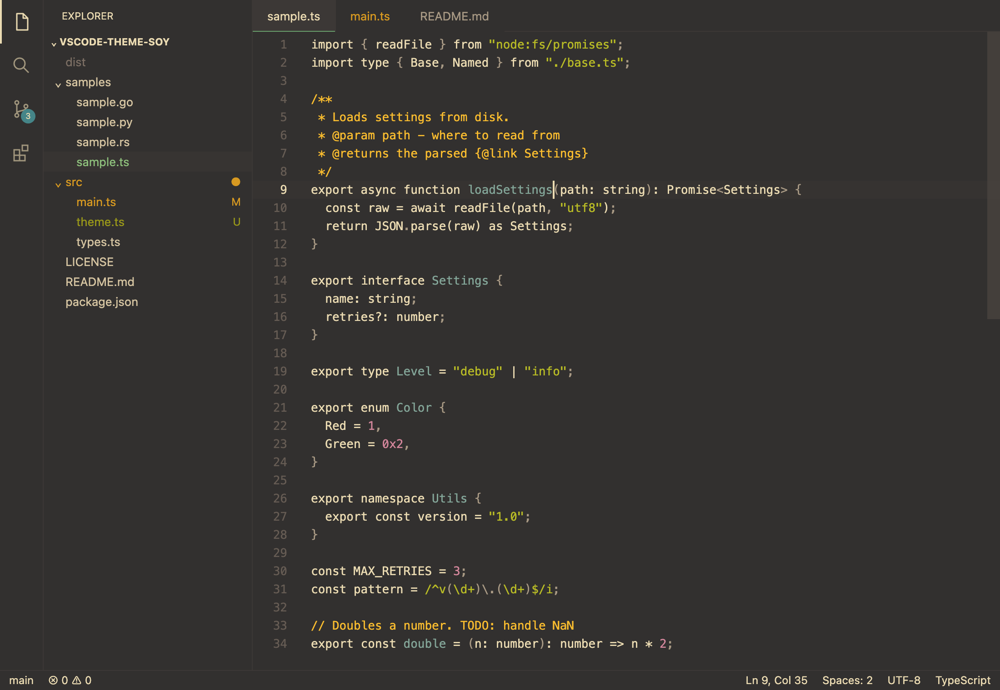
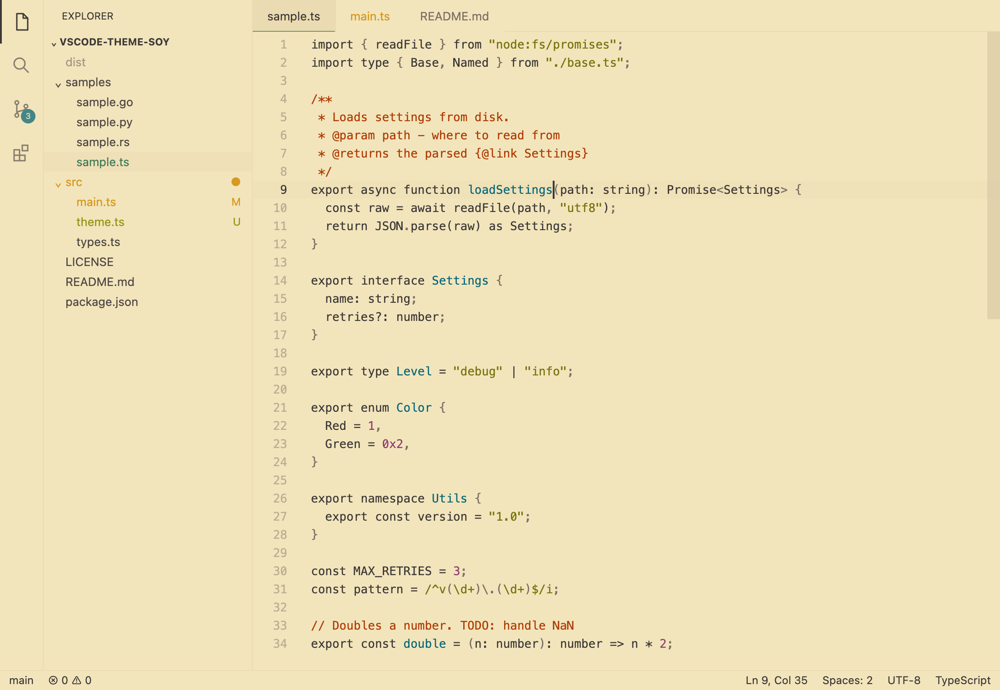
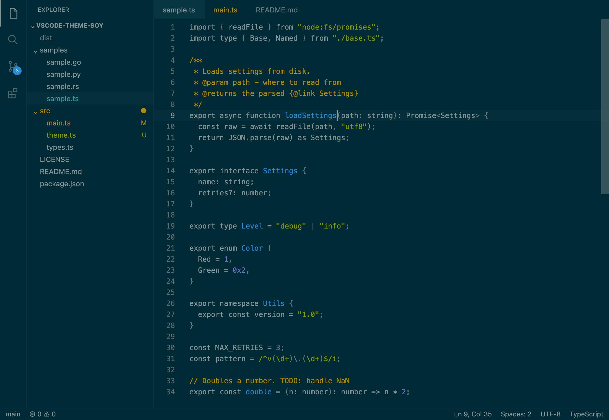
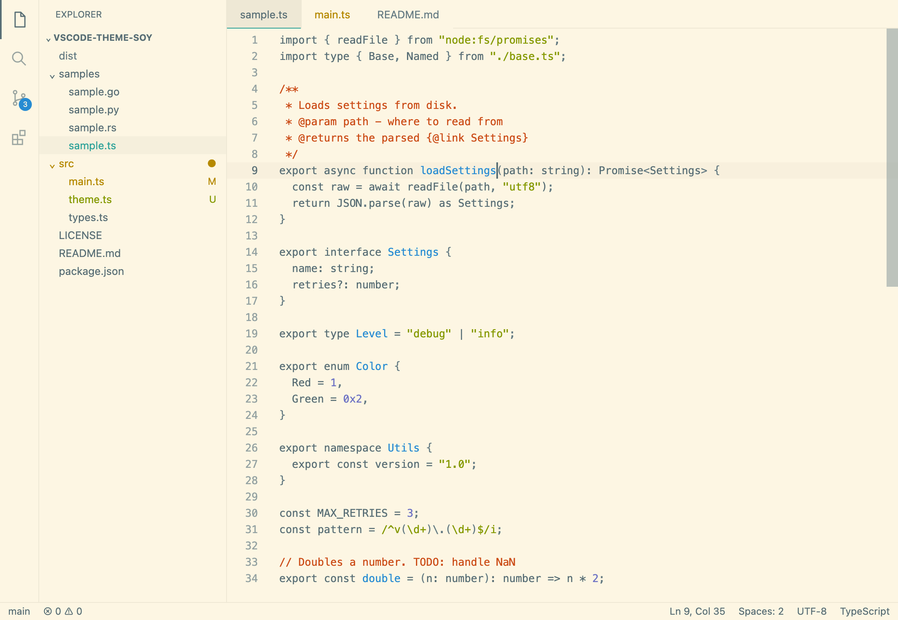
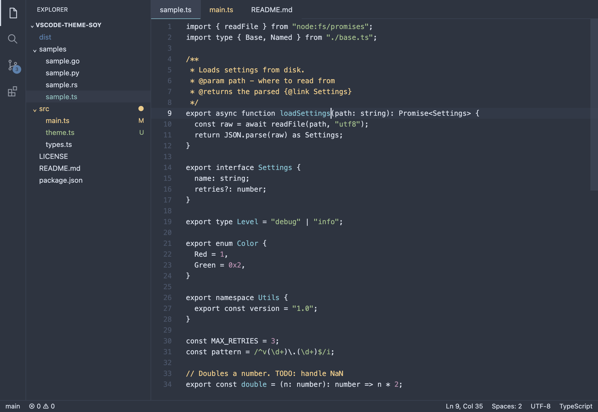

<p align="center">
  <br>
  <a href="https://marketplace.visualstudio.com/items?itemName=tsangkenneth.vscode-theme-soy">
    
  </a>
</p>

# Soy Themes

VS Code themes with **minimal syntax highlighting** and a **fully colored UI**,
in Gruvbox, Solarized and Nord variants.

The editor colors only what helps you read code: comments, strings, constants
and definitions. Keywords, variables and function calls stay the plain text
color, and comments are prominent rather than dimmed. The rest of the workbench
(sidebar, tabs, status bar, terminal, git decorations and so on) uses the full
palette.

### Inspiration and credits

- [I am sorry, but everyone is getting syntax highlighting wrong](https://tonsky.me/blog/syntax-highlighting/)
  by Nikita Prokopov ([tonsky](https://github.com/tonsky)) sets out the
  principles for the syntax highlighting.
- [Alabaster](https://github.com/tonsky/vscode-theme-alabaster), also by
  [tonsky](https://github.com/tonsky), is the reference implementation of those
  principles for VS Code.
- [Gruvbox Theme](https://github.com/jdinhify/vscode-theme-gruvbox) by
  [jdinhify](https://github.com/jdinhify) provides the theme generator and the
  UI color mappings this project is built on.

Both projects are MIT licensed; their notices are reproduced in
[LICENSE](LICENSE).

The color palettes are [Gruvbox](https://github.com/morhetz/gruvbox) by Pavel
Pertsev, [Solarized](https://ethanschoonover.com/solarized/) by Ethan Schoonover
and [Nord](https://www.nordtheme.com/) by Sven Greb.

This project was created with help from an LLM.
[Claude](https://www.anthropic.com/claude) helped write the code, documentation,
and screenshot tooling.

### Why “Soy”?

Soybeans are amazing! They can be plain (_minimalist_) but also made into a wide
variety of foods (_variants_): soymilk, tofu, miso, edamame, etc.

## Installation

- **VS Code:** search for "Soy Themes" in the Extensions view, or install it
  from the
  [Visual Studio Marketplace](https://marketplace.visualstudio.com/items?itemName=tsangkenneth.vscode-theme-soy).
- **Manually,** including in VSCodium, Cursor and other editors based on VS
  Code: download the `.vsix` from
  [GitHub Releases](https://github.com/tsangkenneth/vscode-theme-soy/releases)
  and run **Extensions: Install from VSIX...**.

Then run **Preferences: Color Theme** and pick one of the Soy variants.

## Variants

<table>
  <tr>
    <td><b>Soy Gruvbox Dark - Medium Contrast</b><br></td>
    <td><b>Soy Gruvbox Light - Medium Contrast</b><br></td>
  </tr>
  <tr>
    <td><b>Soy Gruvbox Dark - Hard Contrast</b><br></td>
    <td><b>Soy Gruvbox Light - Hard Contrast</b><br></td>
  </tr>
  <tr>
    <td><b>Soy Gruvbox Dark - Soft Contrast</b><br></td>
    <td><b>Soy Gruvbox Light - Soft Contrast</b><br></td>
  </tr>
  <tr>
    <td><b>Soy Solarized Dark</b><br></td>
    <td><b>Soy Solarized Light</b><br></td>
  </tr>
  <tr>
    <td><b>Soy Nord</b><br></td>
    <td></td>
  </tr>
</table>

## How code is colored

The syntax highlighting follows the principles in Nikita Prokopov's article
[I am sorry, but everyone is getting syntax highlighting wrong](https://tonsky.me/blog/syntax-highlighting/)
and his [Alabaster](https://github.com/tonsky/vscode-theme-alabaster) theme:

- **Few colors.** There are four highlight colors, few enough to remember, so
  you can look for "the green thing" when you want a string.
- **Highlight what you search for, not what is everywhere.** Keywords like `if`
  and `function` are obvious from their shape, and variables and calls make up
  most of the code. Coloring them would color everything.
- **Definitions, not uses.** A function, class or type is colored where it is
  declared, which shows the structure of a file at a glance. Calls and
  references are plain text.
- **Comments are prominent.** If code needed an explanation, that explanation
  should be the first thing you read, not a faded grey.
- **Punctuation is slightly dimmed** so the names around it stand out.
- **No bold or italics** in code.

| Role        | What                                                    |
| ----------- | ------------------------------------------------------- |
| Comment     | Comments, including doc comments                        |
| String      | Strings and regular expressions                         |
| Constant    | Literals: numbers, booleans, `null`, symbols            |
| Definition  | Functions, classes, types and modules where declared    |
| Punctuation | Brackets, separators, escape sequences, `${` and `}`    |
| Text        | Everything else: keywords, variables, calls, references |

Each variant takes these colors from its own palette:

| Role        | Gruvbox Dark     | Gruvbox Light    | Solarized Dark   | Solarized Light  | Nord             |
| ----------- | ---------------- | ---------------- | ---------------- | ---------------- | ---------------- |
| Comment     | yellow `#fabd2f` | orange `#af3a03` | yellow `#b58900` | orange `#cb4b16` | nord13 `#ebcb8b` |
| String      | green `#b8bb26`  | green `#79740e`  | green `#859900`  | green `#859900`  | nord14 `#a3be8c` |
| Constant    | purple `#d3869b` | purple `#8f3f71` | violet `#6c71c4` | violet `#6c71c4` | nord15 `#b48ead` |
| Definition  | blue `#83a598`   | blue `#076678`   | blue `#268bd2`   | blue `#268bd2`   | nord8 `#88c0d0`  |
| Punctuation | fg4 `#a89984`    | fg4 `#7c6f64`    | base00 `#657b83` | base00 `#657b83` | nord4 `#d8dee9`  |
| Text        | fg1 `#ebdbb2`    | fg1 `#3c3836`    | base0 `#839496`  | base01 `#586e75` | nord4 `#d8dee9`  |

### Language servers

Language servers for TypeScript, Python, Rust and others send semantic tokens,
which VS Code uses on top of the grammar's colors. Soy colors those the same
way: declarations get the definition color, and everything else stays plain.

Some grammars can't tell a definition from a use, and then the language server
decides:

- **Go:** type declarations are plain unless gopls semantic tokens are on
  (`"gopls": { "ui.semanticTokens": true }`).
- **C#:** method calls are colored like method declarations.

## Palettes

Each variant uses only the colors of its original palette, with no blended or
adjusted shades. Where a palette's usual color for something is too faint to
read, the closest palette color with enough contrast is used instead. Body text
aims for a contrast ratio of at least 4.5:1 against the background, and
highlights at least 3:1. For example:

- **Solarized Light** uses base01 for body text rather than base00 (4.1:1), and
  orange for comments because yellow is 3.0:1. Its green strings are 2.97:1, the
  one color just under target, kept so strings are green in both Solarized
  variants.
- **Nord** has no shade between nord3 (1.7:1) and nord4, so punctuation is not
  dimmed, and dimmed UI text such as ignored files uses nord10.

The terminal uses the official ANSI colors of Solarized and Nord.

## Development

The generator is plain TypeScript with no dependencies. It runs on Deno, Node
(22.18 or later, which runs `.ts` files directly) or Bun.

```sh
deno task build        # or: node src/main.ts / bun src/main.ts
deno task check        # format, lint, type check and contrast check
deno task preview      # show how a variant colors the samples
deno task screenshots  # regenerate the images in images/
deno task package      # build the .vsix extension package
```

Node and Bun can run the scripts directly, e.g. `node scripts/check.ts` or
`bun scripts/preview.ts`.

`build` writes one JSON file per variant to `themes/` and updates
`contributes.themes` in `package.json` to match `src/variants.ts`. Commit the
generated themes along with the source changes.

`check` fails if a variant is inconsistent (for example, its syntax text color
differs from the editor foreground) or the generated files are out of date, and
warns about any color below its contrast target. CI runs it on every push and
pull request, along with the build on Node and Bun and a test package. See
[RELEASING.md](RELEASING.md) for publishing.

To try the themes, open this folder in VS Code and press <kbd>F5</kbd>. This
opens an Extension Development Host window where the Soy themes are available in
**Preferences: Color Theme**. Rebuild and reload that window (**Developer:
Reload Window**) to see changes. The files in `samples/` cover the cases that
matter for the syntax rules, and **Developer: Inspect Editor Tokens and Scopes**
shows which rule colored a token.

### Previewing syntax colors in the terminal

`scripts/preview.ts` colors files with VS Code's own grammars and TextMate
engine, so you can check syntax rules without opening VS Code. It reads the
grammars from your VS Code installation, and uses the two development
dependencies in `package.json` (Deno fetches them automatically; with Node or
Bun, run `npm install` or `bun install` first).

```sh
deno task preview                                  # all samples, first variant
deno task preview --variant soy-nord samples/sample.py
deno task preview --plain samples/sample.ts        # [text|role] markup
deno task preview --plain --scopes Settings samples/sample.ts
```

In a terminal it prints the code in the theme's colors. With `--plain`, or when
the output is piped, colored tokens are marked as `[text|role]` instead, and
`--scopes <text>` lists the TextMate scopes of matching tokens. Semantic
highlighting needs a language server, so the preview shows TextMate colors only.
If VS Code is installed somewhere unusual, pass its built-in extensions folder
with `--extensions <dir>`.

### Screenshots

`scripts/screenshots.ts` draws a simplified VS Code window for each variant,
using the theme's colors and the same tokenizer as the preview, and saves it to
`images/<variant>.png` with headless Chrome, Chromium or Edge. The window is an
approximation; the code colors are what VS Code shows without a language server.
Rerun it after changing colors, or pass `--variant <id>` for one variant and
`--chrome <path>` if the browser isn't found.

### Layout

| Path                     | Purpose                                           |
| ------------------------ | ------------------------------------------------- |
| `src/main.ts`            | Entry point: writes themes and syncs the manifest |
| `src/theme.ts`           | Builds the theme JSON for a variant               |
| `src/variants.ts`        | The list of variants to generate                  |
| `src/palettes/`          | Palette definitions, one file per family          |
| `src/ui/`                | Workbench (non-syntax) color mappings             |
| `src/syntax/`            | Token and semantic token rules for code           |
| `src/types.ts`           | Shared types: palette slots and syntax roles      |
| `scripts/check.ts`       | Consistency and contrast checks for every variant |
| `scripts/preview.ts`     | Terminal preview of syntax colors                 |
| `scripts/screenshots.ts` | Renders the images in `images/`                   |
| `scripts/lib/`           | Shared tokenizer for the preview and screenshots  |
| `themes/`                | Generated theme files                             |
| `images/`                | Generated screenshots for this README             |
| `samples/`               | Code samples for checking the syntax rules        |
| `.github/workflows/`     | CI and release workflows                          |

## License

[MIT](LICENSE)
